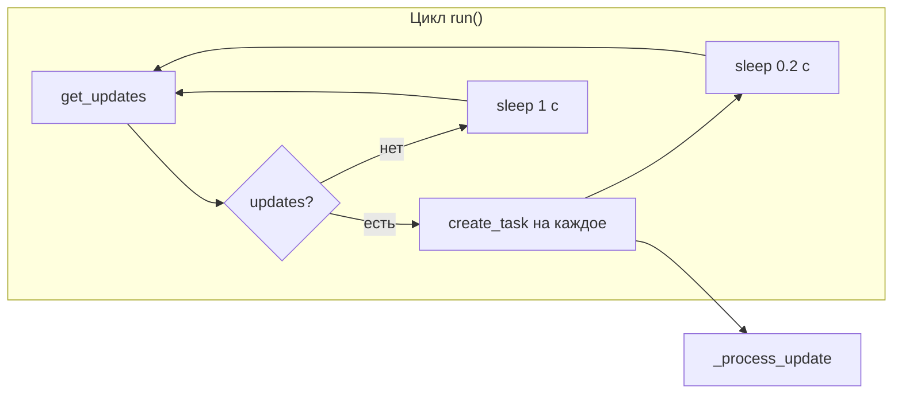
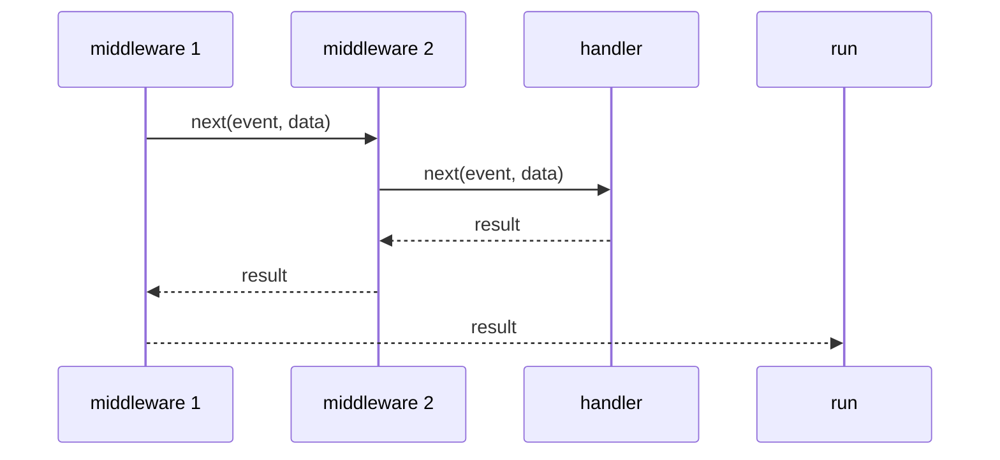
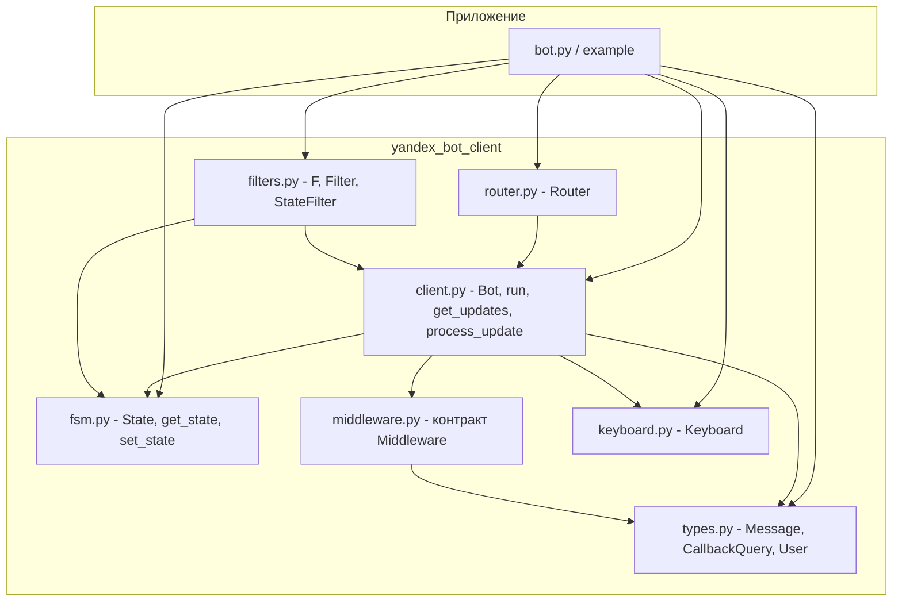

# Схема работы yandex_bot_client

Краткое описание потока данных и связей между модулями библиотеки.

---

## 1. Главный цикл (run)

При вызове `bot.run()` бот входит в цикл long polling и обрабатывает обновления до остановки (Ctrl+C или `stop()`).



- **get_updates** — HTTP GET к API с `offset`, таймаут 60 с. При сетевой ошибке возвращается `[]`, цикл не падает.
- Каждое обновление обрабатывается в **отдельной задаче** (до 128 параллельно, Semaphore).
- Пауза после ответа: **0.2 с**, если были обновления; **1 с**, если пусто — чтобы быстрее забирать следующие сообщения и не долбить API в простое.

---

## 2. Обработка одного обновления

Вход: сырой `update` (dict) из API. Выход: вызов подходящего хендлера и при необходимости отправка ответа.

```mermaid
flowchart TB
    U[update] --> P[_parse_update]
    P --> R{payload?}
    R -->|да| CB[_handle_callback]
    R -->|нет| MSG[Текстовое сообщение]

    subgraph callback ["Кнопка (callback)"]
        CB --> CMD{есть cmd?}
        CMD -->|да| BTN[button_handlers по action]
        CMD -->|нет| CBH[callback_handlers по filter]
        BTN --> DONE1[ответ]
        CBH --> DONE1
    end

    subgraph message ["Текст"]
        MSG --> CTX[установить _current_login, _current_bot]
        CTX --> STATE[get_state(login)]
        STATE --> MH[перебор message_handlers]
        MH --> M{state + text + filter?}
        M -->|да| MW1[middleware chain]
        MW1 --> HANDLER[handler]
        M -->|нет| DH[default_handlers]
        DH --> MW2[middleware] --> HANDLER
        HANDLER --> CTX2[сброс контекста]
        CTX2 --> DONE2[ответ или "Не понимаю"]
    end
```

- **payload есть** → нажатие кнопки: сначала `button_handler` по `cmd`/`action`, иначе `callback_handler` по фильтру.
- **payload нет** → текст: подбор `message_handler` по state, text, filter; при отсутствии совпадения — `default_handler`. Перед хендлером при наличии зарегистрированных — цепочка **middleware** (event + data).

---

## 3. Middleware

Если зарегистрирован хотя бы один middleware, перед вызовом хендлера выполняется цепочка:



- Сигнатура: `async def mw(handler, event, data): return await handler(event, data)`.
- `event` — `Message` или `CallbackQuery`; `data` — dict, можно дополнять для хендлера.
- Порядок вызова — порядок регистрации через `bot.middleware(mw)`.

---

## 4. Модули и зависимости



- **client** — ядро: цикл опроса, разбор обновлений, маршрутизация, вызов middleware и хендлеров.
- **router** — группа хендлеров; при `include_router(router)` обработчики копируются в бота (в конец списков).
- **filters** — F, Filter, StateFilter; для message-хендлеров проверки по update и FSM.
- **fsm** — хранение состояния по login в `bot._fsm_states`; используется при выборе хендлера по `state=`.
- **middleware** — только контракт; регистрация и запуск цепочки в client.
- **keyboard** — сборка клавиатуры для `send_message` / `reply`.
- **types** — обёртки над сырым update для хендлеров.

---

## 5. Контекст и данные по пользователю

| Что | Где хранится | Назначение |
|-----|--------------|------------|
| Текущий login и bot в задаче | `_current_login`, `_current_bot` (contextvars) | `reply()`, `Bot.current()`, `current_login()` без передачи bot в хендлер |
| FSM-состояние | `bot._fsm_states[login]` | Выбор хендлера по `state=`, доступ через `get_state` / `set_state` |
| Сессия пользователя | `bot._user_states[login]` | Произвольные данные через `bot.state(login)` |

Контекст выставляется в начале `_process_update` / `_handle_callback` и сбрасывается в `finally`, поэтому из фоновой задачи (`create_task` вне этого потока) вызывать `reply()` нельзя — контекста там нет.

---

## 6. Порядок срабатывания хендлеров

- **message_handlers**: сначала хендлеры, зарегистрированные на самом боте, затем из роутеров в порядке `include_router`. Первый подходящий по state + text + filter обрабатывает сообщение (если не вернул `False`).
- **default_handlers**: если ни один message_handler не сработал — перебор default в том же порядке; при отсутствии подходящего — ответ «Не понимаю…».
- **button_handlers**: по `action` (cmd без слэша) и state; первый совпавший вызывается.
- **callback_handlers**: если у кнопки нет cmd или для cmd нет button_handler — перебор по фильтру `(update, payload)`.

Все списки хендлеров после `include_router` общие: бот + роутер 1 + роутер 2 + … в порядке добавления.
